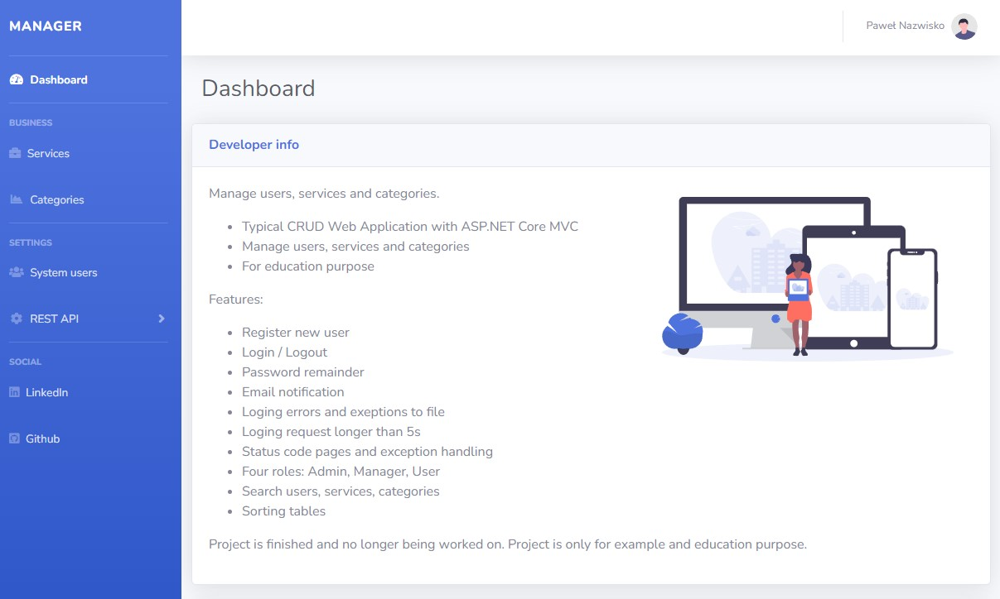
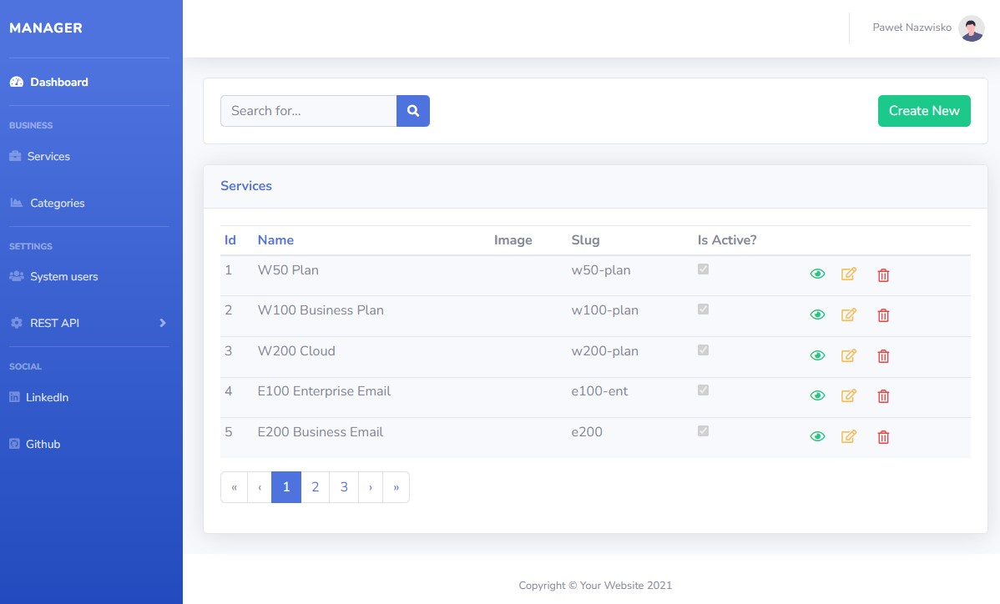
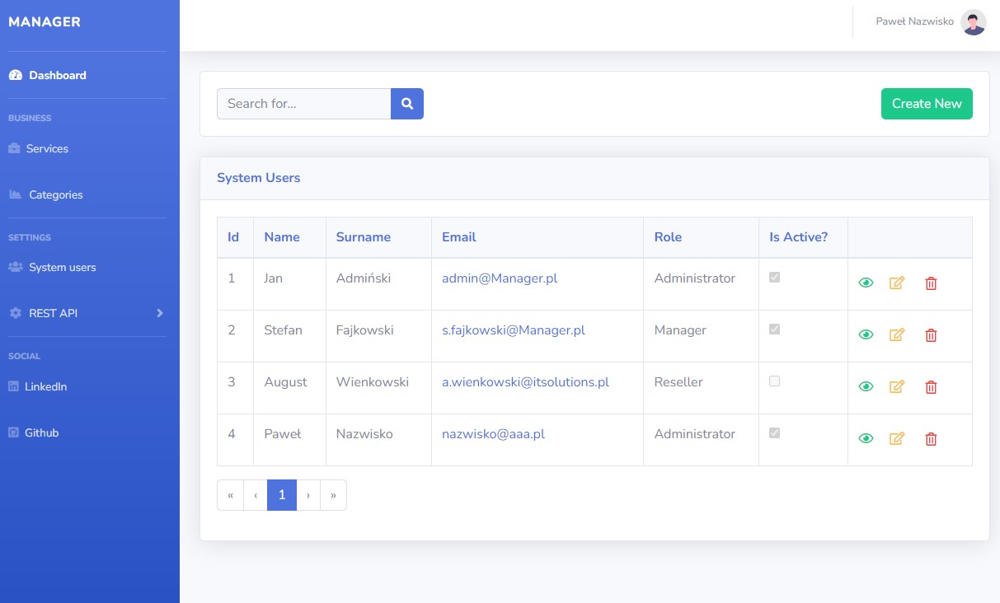
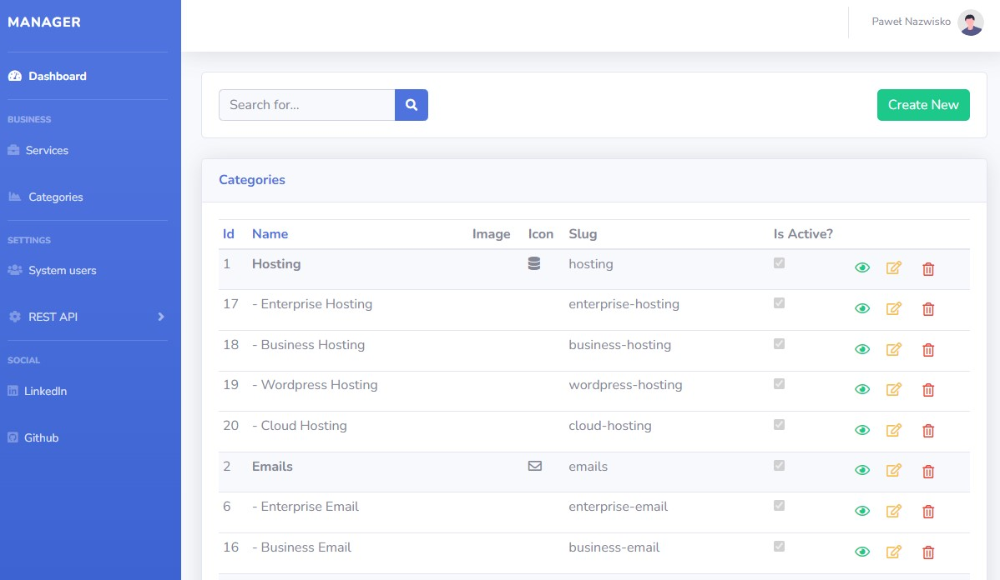

# Manager
> It's typical CRUD Web Application with ASP.NET Core MVC 
> 
> Live demo [_here_](https://netcoremanager.azurewebsites.net/). 
> ```
>Login: user@manager.pl
> Password: Password123
> ```
>Run in Docker: https://hub.docker.com/repository/docker/avenus/manager


## Table of Contents
* [General Info](#general-information)
* [Technologies Used](#technologies-used)
* [Features](#features)
* [Database relationshop diagram](#databaseRelationshopDiagram)
* [Screenshots](#screenshots)
* [Dependencies](#dependencies)
* [Project Status](#project-status)
* [Contact](#contact)
* [License](#license)


## General Information
- Manage users, categories and services
- CRUD Web Application with ASP.NET Core MVC
- For education purpose
<!-- You don't have to answer all the questions - just the ones relevant to your project. -->


## Technologies Used
- ASP.NET Core Web APP (Model-View-Controller)
- SQL Server 2014


## Features
- Register new user
- Login / Logout
- Password remainder
- Email notification
- Loging errors and exeptions to file
- Loging request longer than 5s
- Status code pages and exception handling
- Roles: Admin, Manager, User
- Search users, services, categories 
- Sort tables


## Database relationshop diagram
[https://dbdiagram.io/d/616692b1940c4c4eec92ae00]("https://dbdiagram.io/d/616692b1940c4c4eec92ae00")


## Screenshots






## Dependencies
Packeges used in the project:

- AutoMapper 8.1.1
- FluentValidation 10.3.3
- FluentEmail.Core 3.0.0
- FluentEmail.MailKit 3.0.0
- FluentEmail.Razor 3.0.0
- Microsoft.AspNetCore.Mvc.Razor.RuntimeCompilation 5.0.11
- Microsoft.EntityFrameworkCore 5.0.11
- Microsoft.EntityFrameworkCore.SqlServer 5.0.11
- Microsoft.EntityFrameworkCore.Tools 5.0.11
- NLog.Web.AspNetCore 4.14.0
- Vereyon.Web.FlashMessage 3.0.0


## Project Status
Project _is finished and no longer being worked on_. Project is only for example and education purpose.


## Contact
Created by [@pdm](https://www.linkedin.com/in/pawe%C5%82-dmochowski/) - feel free to contact me!


<!-- Optional -->
## License 
This project is open source. Fell free to use and modify.

 